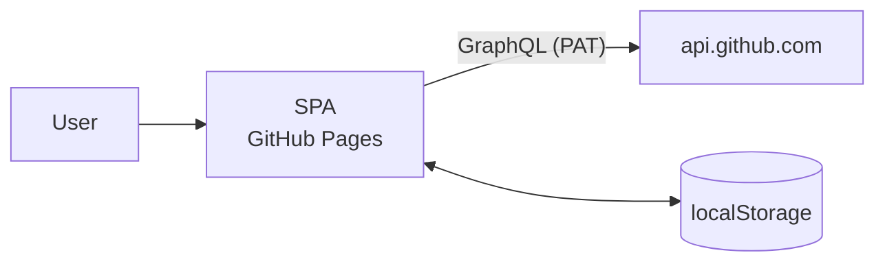
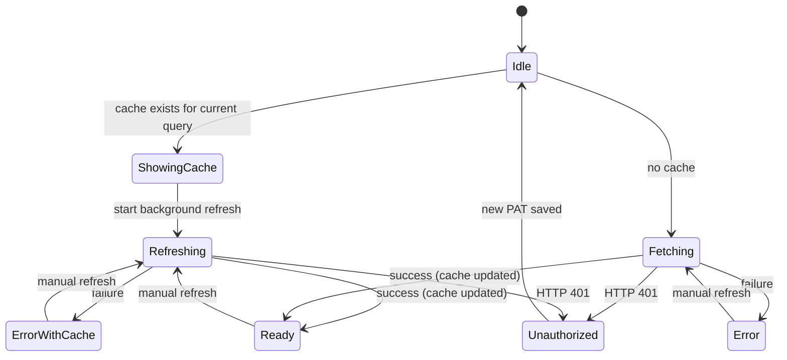

# ARCHITECTURE

Architecture design for review-dashboard.
See [REQUIREMENTS.md](REQUIREMENTS.md) for requirements and [GLOSSARY.md](GLOSSARY.md) for terminology.

## Overview

A static SPA served by GitHub Pages calls the GitHub GraphQL API directly from the browser.
There is no server or proxy. (NFR-2)



## Technology stack

| Area | Choice |
|------|--------|
| Language | TypeScript |
| UI | React |
| Build | Vite |
| Test | Vitest |
| API | GitHub GraphQL API (called directly with `fetch`) |
| Persistence | localStorage |
| Deploy | GitHub Actions (`actions/deploy-pages`) to GitHub Pages |

The only runtime dependency is React.
No GraphQL client or data-fetching library is used: fetching is simple, and more dependencies would widen the surface of third-party code running next to the PAT. (NFR-5)

## Design principles

The app follows Functional Core, Imperative Shell.

- **domain**: Types and pure functions. Holds logic such as grouping, sorting, and cache validity checks. Performs no I/O
- **infra**: I/O to the GitHub API and localStorage. Converts between external formats and domain types
- **app**: React hooks that connect domain and infra and manage state transitions (show cache → background refresh)
- **ui**: Presentation-only React components

Dependencies point `ui → app → (domain, infra)` and `infra → domain`; domain depends on nothing.

Domain values are validated on construction, so no instance with an invalid value can exist.
For example, constructing a search query from an empty string raises an error. (FR-QUERY-5)

## Directory layout

```text
src/
  domain/
    pullRequest.ts   # Types: PullRequest, Review, ReviewState, DiffStat
    searchQuery.ts   # SearchQuery construction and validation, DEFAULT_QUERY
    viewSettings.ts  # Grouping, SortKey, SortDirection, AutoRefreshMinutes, ViewSettings and defaults
    sort.ts          # sortPullRequests(prs, sortKey, direction)
    group.ts         # groupPullRequests(prs, grouping)
    cache.ts         # Cache type, cacheFor(cache, query), withCache(caches, cache, limit)
  infra/
    github.ts        # searchPullRequests(token, query, signal): GraphQL call and pagination
    githubMapper.ts  # GraphQL response → PullRequest conversion
    storage.ts       # localStorage reads and writes
    url.ts           # Reads and writes the search query in the page URL (`q` parameter)
  app/
    usePullRequests.ts  # State for cache display, fetching, and errors
    useSettings.ts      # Reads and writes the PAT and view settings
    autoRefresh.ts      # shouldAutoRefresh(state), scheduleAutoRefresh(state, minutes, refresh)
    useAutoRefresh.ts   # Schedules automatic refreshes and exposes the timer for the progress bar
    useNow.ts           # Current time, updated every minute, for relative times
  ui/
    App.tsx
    TokenForm.tsx       # PAT input screen
    QueryBar.tsx        # Edit, apply, and reset the search query
    StatusBar.tsx       # Last fetched time, in-progress indicator, errors, manual refresh, auto refresh bar
    SettingsDialog.tsx  # Relative times, auto refresh interval, log out
    PullRequestTable.tsx
    GroupSection.tsx
    ReviewBadges.tsx
  main.tsx
```

## Data model

```ts
type ReviewState = "APPROVED" | "CHANGES_REQUESTED" | "COMMENTED" | "DISMISSED";

type Actor = {
  readonly login: string;
  readonly avatarUrl: string | null; // null unless it starts with https://avatars.githubusercontent.com/
};

type Review = {
  readonly reviewer: Actor | null;   // null if the user account has been deleted
  readonly state: ReviewState;
  readonly submittedAt: string;  // ISO 8601
};

type StackPosition = {
  readonly number: number;     // stack number within the repository
  readonly position: number;   // 1 is closest to the base branch
  readonly size: number;
};

type PullRequest = {
  readonly number: number;
  readonly title: string;
  readonly isDraft: boolean;
  readonly url: string;
  readonly repository: string;   // nameWithOwner
  readonly owner: string;
  readonly author: Actor | null;
  readonly diffStat: { readonly additions: number; readonly deletions: number; readonly changedFiles: number };
  readonly createdAt: string;
  readonly updatedAt: string;
  readonly latestReviews: readonly Review[];
  readonly stack: StackPosition | null;   // null when not in a stacked PR
};

type Grouping = "none" | "owner" | "repository";
type SortKey = "number" | "title" | "owner" | "repository" | "author" | "diff" | "createdAt" | "updatedAt";
type SortDirection = "asc" | "desc";
type AutoRefreshMinutes = 0 | 1 | 5 | 10 | 30; // 0 = off

type ViewSettings = {
  readonly grouping: Grouping;
  readonly sortKey: SortKey;
  readonly sortDirection: SortDirection;
  readonly relativeTime: boolean;
  readonly autoRefreshMinutes: AutoRefreshMinutes;
};

type Cache = {
  readonly query: SearchQuery;
  readonly fetchedAt: string;
  readonly pullRequests: readonly PullRequest[];
};
```

All types are readonly; state is updated by creating new values.
Review results outside the displayed set, such as `PENDING`, are dropped during conversion in infra.
`avatarUrl` values that do not start with `https://avatars.githubusercontent.com/` are converted to `null` in infra, so the UI never loads images from other hosts (see the CSP in [Security](#security)).
Sorting by author compares `author.login`.
Sorting by repository compares the repository name without the owner, as shown in the Repository column.

## GitHub API

### Fetch query

GraphQL `search` fetches PRs together with their related data in a single request.
GraphQL is chosen because the REST API would need extra requests per PR for diff stats and reviews.

```graphql
query SearchPullRequests($query: String!, $after: String) {
  search(query: $query, type: ISSUE, first: 50, after: $after) {
    issueCount
    pageInfo { hasNextPage endCursor }
    nodes {
      ... on PullRequest {
        number
        title
        isDraft
        url
        author { login avatarUrl(size: 40) }
        additions
        deletions
        changedFiles
        createdAt
        updatedAt
        repository { nameWithOwner owner { login } }
        latestReviews(first: 20) {
          nodes { author { login avatarUrl(size: 40) } state submittedAt }
        }
        stackEntry { position stack { number size } }
      }
    }
  }
}
```

- `latestReviews` already returns the latest review per reviewer, so the app does not need to aggregate them (FR-LIST-3)
- A search query without `is:pr` can also return issues, so non-PullRequest nodes are dropped during conversion
- `avatarUrl(size: 40)` requests images at twice the 20px display size
- `stackEntry` is null for PRs not in a stacked PR; its `stack` can also be null, and either case becomes `stack: null` (FR-LIST-14)
- Paginate with `endCursor` until `hasNextPage` is false or 1,000 results are reached (NFR-6)

### Authentication and errors

- Send `Authorization: bearer <PAT>` in the request header
- Treat HTTP 401 as an error meaning the PAT is invalid (FR-AUTH-3)
- Treat rate limiting (HTTP 403/429 or a GraphQL `RATE_LIMITED` error) and network errors as fetch failures (FR-ERR-1)
- If the search query changes during a fetch, abort the old request with `AbortController` and discard its result

### PAT permissions

- Classic PAT: the `repo` scope is required to include private repositories
- Fine-grained PAT: it can access only one resource owner, so searches spanning multiple organizations return incomplete results. The PAT input screen explains this limitation

## State transitions

`usePullRequests` follows this flow on access and when a search query is applied.



- While Refreshing, keep showing the cached list and indicate that a fetch is in progress (FR-CACHE-3, FR-CACHE-5)
- On failure, keep showing the list if a cache exists (FR-ERR-2)
- Applying a search query starts over from Idle with the new query (FR-CACHE-6)
- In Unauthorized, the PAT input screen is shown instead of the list (FR-AUTH-3). The PAT and the cache are kept until a new PAT is saved or the user logs out. Saving a new PAT returns to Idle, so an existing cache is shown again while it is refreshed
- Logging out from any state removes the PAT and the cache and shows the PAT input screen (FR-AUTH-2)

### Auto refresh

`useAutoRefresh` dispatches the same event as a manual refresh when the interval passes; the state transitions above are unchanged. (FR-CACHE-7, FR-CACHE-8)

- It schedules a refresh in Ready, and in ErrorWithCache and Error when the error is a network error or another error. It schedules nothing in other states, so an automatic refresh never overlaps a running fetch, and it stops after a rate limit error or Unauthorized until the next successful fetch
- The interval counts from when the state was entered (or the interval was changed), not from the cache's `fetchedAt`. ErrorWithCache keeps the cache of the last successful fetch, so counting from `fetchedAt` would retry immediately after every failure
- The timer restarts whenever `status`, `requestId`, or the interval changes. `requestId` changes on every request, so every finished fetch restarts the timer

## Persistence

localStorage keys are prefixed with `review-dashboard:v1:`.
When the storage format changes, bump the version and stop reading the old keys.

| Key | Contents | Removed when |
|-----|----------|--------------|
| `review-dashboard:v1:token` | PAT | Log out |
| `review-dashboard:v1:view` | View settings (JSON), including the time display and auto refresh interval | Never |
| `review-dashboard:v1:cache` | Caches (JSON array, newest first) | Log out; the oldest is dropped when a sixth search query is fetched |

- The caches hold results for the five most recently fetched search queries, one per search query. If saving all of them exceeds the quota, only as many of the newest as fit are saved
- The search query is not stored in localStorage. It lives in the page URL as the `q` parameter (omitted for the default query), so pages with different search queries can be open at the same time. Applying a search query adds a history entry, and browser back and forward apply the search query of that entry
- On read, parse the JSON and validate its shape; treat invalid values as absent
- View settings saved before `relativeTime` and `autoRefreshMinutes` existed are still read: those two fields fall back to their defaults when missing or invalid, while grouping and sort keep their values
- Caches saved before `isDraft` existed fail validation and are discarded
- Caches saved before `stack` existed fail validation and are discarded in the same way
- If localStorage is unavailable or a write fails because the quota is exceeded, the page keeps working (it just cannot save)

## Security

Because the PAT is stored in localStorage, preventing XSS is the top priority. (NFR-5)

- Do not load third-party scripts or CDNs at runtime. Dependencies are bundled at build time
- Set a CSP in `index.html` with `<meta>`

  ```html
  <meta http-equiv="Content-Security-Policy"
        content="default-src 'self'; connect-src https://api.github.com; img-src 'self' https://avatars.githubusercontent.com; style-src 'self'">
  ```

- Render strings from the API through React's escaping, and never use `dangerouslySetInnerHTML`
- Links to PRs use `target="_blank" rel="noopener noreferrer"`, and their URL must start with `https://github.com/`

## Build and deploy

- Set Vite's `base` to the repository name (`/review-dashboard/`)
- On push to `main`, GitHub Actions runs tests and the build, then publishes with `actions/upload-pages-artifact` and `actions/deploy-pages`

## Testing

- Unit-test the domain's pure functions (sorting, grouping, search query validation, cache validity) with Vitest
- Test `githubMapper` with GraphQL response fixtures (including dropping issue nodes, dropping `PENDING`, a null author, a null reviewer, and converting an `avatarUrl` on another host to `null`, and mapping `stackEntry`)
- Test `storage` against invalid JSON and values in an old format
- Verify the acceptance criteria in REQUIREMENTS.md manually with a real PAT

## Design decisions

| Decision | Reason | Rejected alternatives |
|----------|--------|-----------------------|
| Authenticate only with a user-entered PAT | GitHub's OAuth token exchange endpoint does not support CORS, so OAuth cannot be completed with static hosting alone | OAuth + external proxy (more infrastructure to run) |
| Use the GraphQL API | Diff stats and reviews come back in a single request | REST API (extra requests per PR) |
| Stale-while-revalidate cache | Gives both instant display and fresh data | TTL-based cache |
| Opt-in auto refresh, off by default | Keeps the list fresh for users who leave the page open, without spending the search API rate limit for everyone else | Always-on polling |
| Store everything in localStorage | The data is small and a synchronous API keeps it simple | IndexedDB, sessionStorage (would force re-entering the PAT every session) |
| Fetch `stackEntry` in the same search query | One request still covers everything the list shows. If GitHub gates or removes the field, every fetch fails; the fix is to drop the field or move it to a separate query | A separate query for stack positions (an extra request per fetch) |
| No data-fetching library | Fetch triggers are few and a custom hook is enough; fewer dependencies shrink the XSS attack surface | TanStack Query, etc. |
